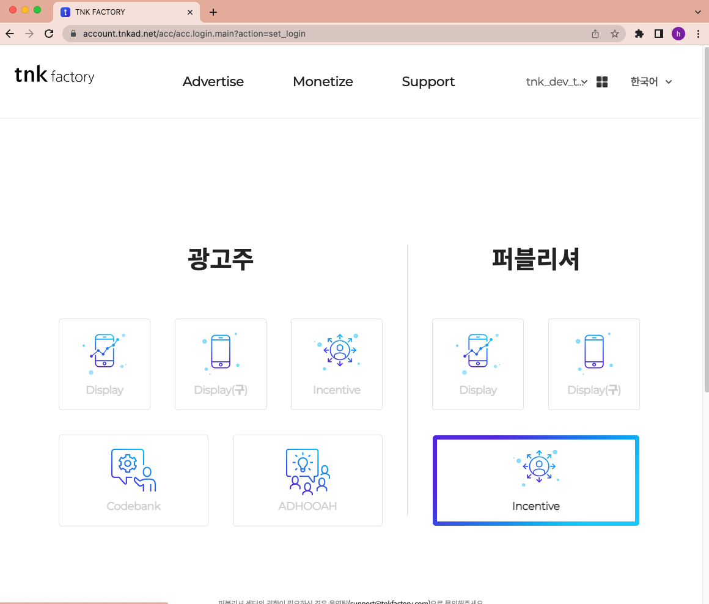
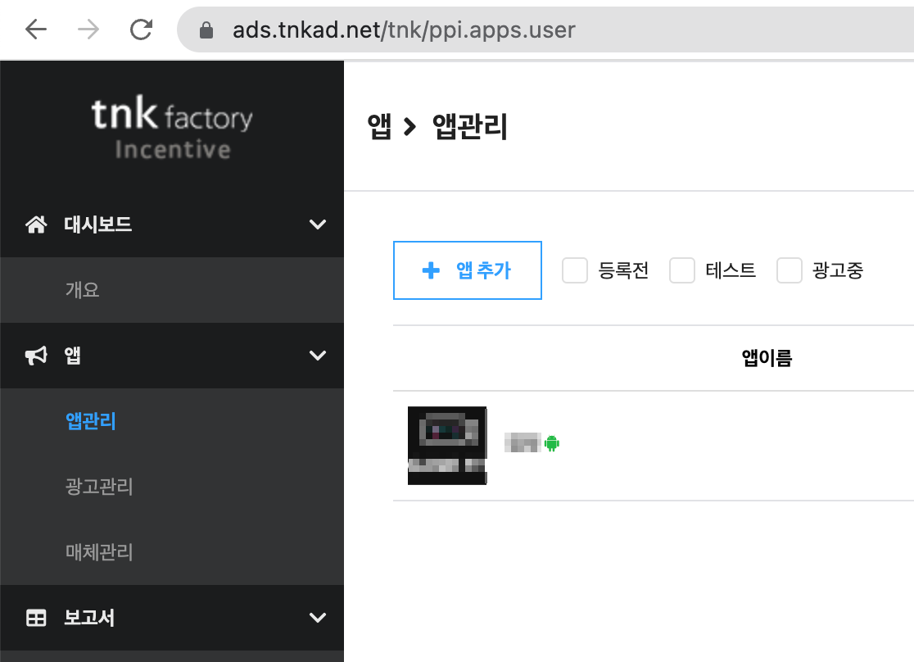
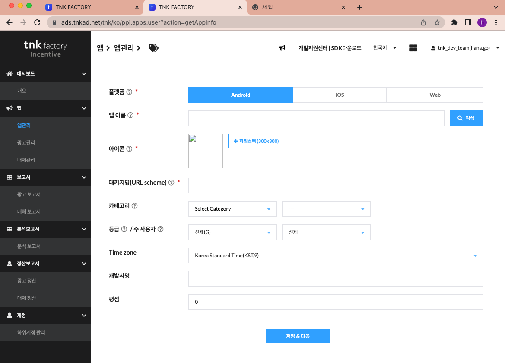
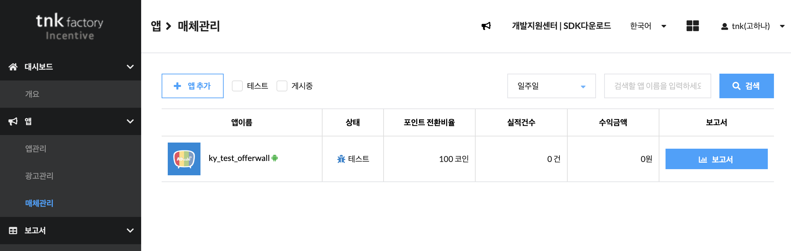

# APP ID 발급받기

SDK 연동에 앞서 **퍼블리셔 페이지에 앱을 등록**하고 `APP ID` 를 발급받아야 합니다.
이 값이 앱의 `tnkad_app_id` 로 들어갑니다.

> Android 와 iOS 는 **각각 따로 등록**해야 합니다. 앱 하나당 플랫폼별로 APP ID 가 하나씩 발급됩니다.

---

## 1. 앱 등록하기

퍼블리셔 페이지에 로그인한 뒤 **퍼블리셔 → Incentive** 를 선택합니다.

좌측 메뉴에서 **앱 → 앱관리** 로 이동해 **+ 앱 추가** 를 누릅니다.

앱 정보를 입력하고 저장합니다.

| 항목 | 설명 |
|------|------|
| **플랫폼** | 사용할 플랫폼을 설정합니다. **Android · iOS 각각 등록**하셔야 합니다 |
| **앱 이름** | 관리 페이지에서 사용할 앱의 이름입니다 |
| **아이콘** | 앱의 아이콘을 등록합니다. 300x300 이하의 PNG 파일로 등록해 주세요 |
| **패키지명** | Android 는 앱의 패키지명(`applicationId`), iOS 는 번들 ID(Bundle Identifier)를 입력합니다 |
| **카테고리** | 앱과 관련된 카테고리를 선택합니다 (미지정 시 기본값 사용, 광고 수익 향상을 위해 선택 권장) |
| **등급 · 주 사용자** | 해당 앱에 노출될 광고의 연령 등급과 주 사용자 성별 필터입니다 |
| **Time zone** | 앱이 주로 사용되는 지역의 타임존 값을 선택합니다 |
| **개발사명** | 해당 앱을 개발한 회사의 이름입니다 |

> ⚠️ **패키지명(번들 ID)은 실제 배포할 앱과 정확히 일치해야 합니다.**
> TNK 는 이 값으로 앱을 식별하므로, 다르면 오퍼월이 정상 동작하지 않습니다.
> 디버그 빌드에서 접미사를 붙이는 설정을 쓰신다면 연동 테스트 시에는 제거하세요.

---

## 2. APP ID 확인

등록은 **앱관리** 에서 했지만, 발급된 값은 **매체관리** 에서 확인합니다.
좌측 메뉴의 **매체관리** 에서 앱을 선택하고, **기본설정** 메뉴 상단의 `AppID` 값을 저장해 두세요.

APP ID 는 등록한 앱(Android App, iOS App, Web 등)의 식별자입니다.

> 서버 보상 콜백 검증에 쓰는 **`app_key`** 도 앱 등록 시 함께 부여되며 같은 페이지에서 확인할 수 있습니다.
> `app_key` 는 **앱에 포함하지 말고 개발사 백엔드에만 보관**하세요.
> ([서버 보상 콜백 URL](../common/server-callback.md) 참고)

---

## 3. 앱에 설정하기

발급받은 APP ID 를 앱에 넣습니다.

- **Android** — [AndroidManifest 설정](../android/manifest.md) 의 `tnkad_app_id` meta-data
- **iOS** — [Info.plist 설정](../ios/plist.md) 의 `tnkad_app_id`, 또는 `configure(appId:)` 로 코드 주입

---

다음: [테스트 기기 등록](test-device.md)
