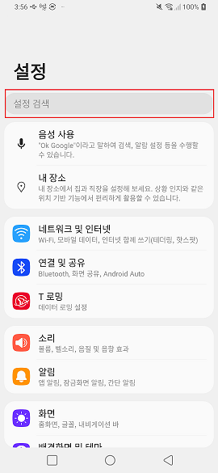
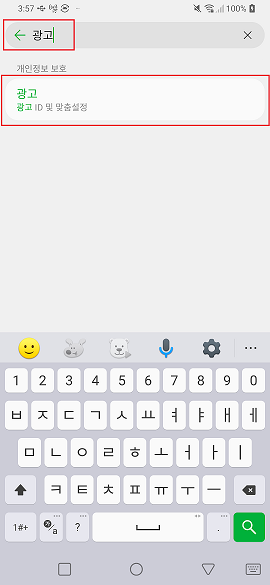
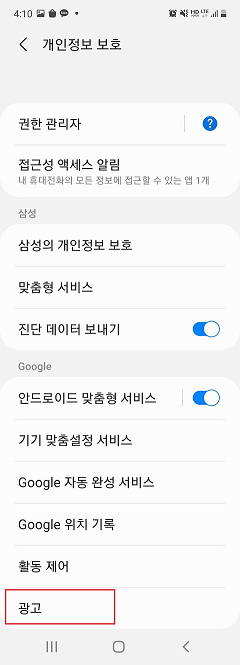
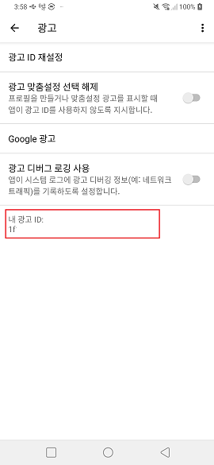
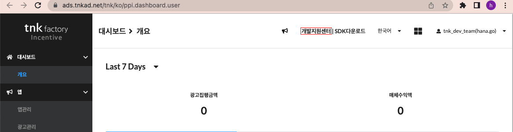
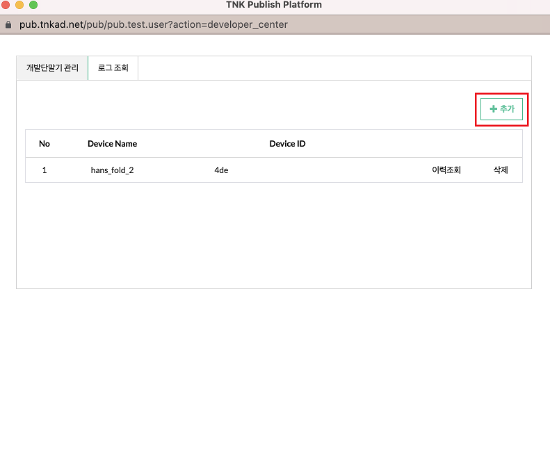
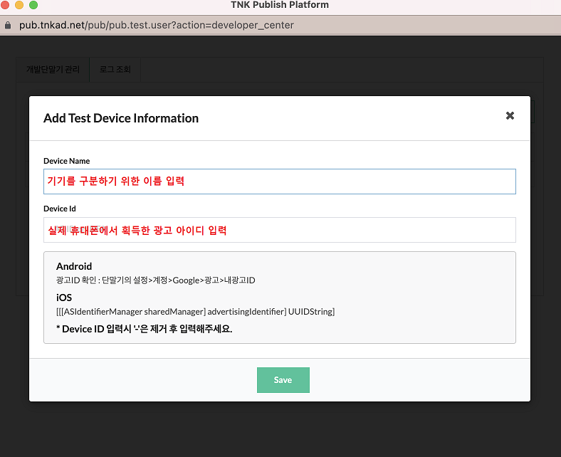
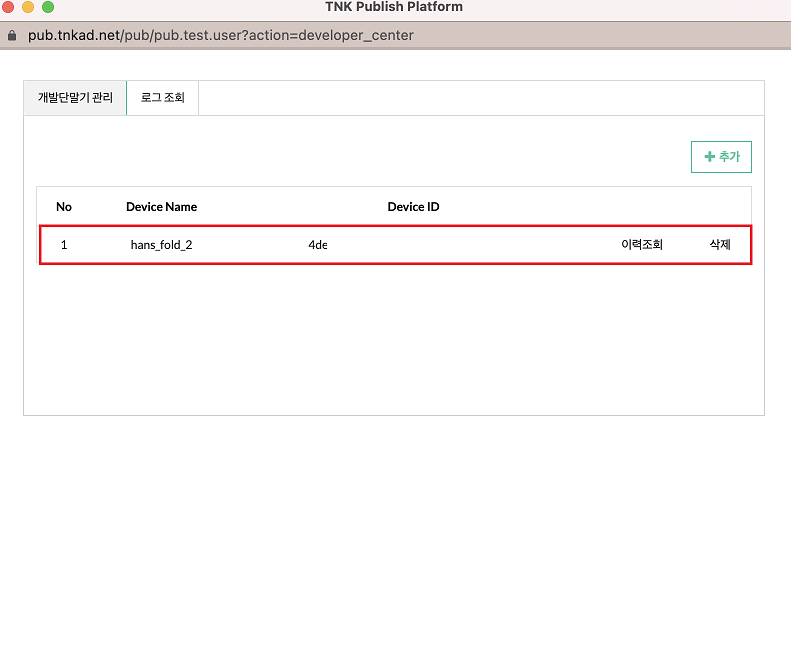

# 테스트 기기 등록

실제 광고를 집행하기 전에, 등록한 기기에서 오퍼월과 광고 참여를 확인할 수 있습니다.
퍼블리셔 페이지에서 테스트 단말을 등록하시면 됩니다.

---

## 1. 광고 ID 확인

테스트 기기를 등록하려면 먼저 **기기의 광고 ID** 를 확인해야 합니다.

기기의 `설정` 화면에서 검색 버튼을 누른 후 **"광고"** 를 입력합니다.

**광고 / 광고 ID 및 맞춤 설정** 을 선택합니다.

이동한 화면 하단의 **광고** 메뉴를 선택합니다.

해당 화면의 **내 광고 ID** 또는 **이 기기의 광고 ID** 라는 항목에 적혀 있는 문자가 광고 ID 입니다.

> 앱에서 직접 확인하실 수도 있습니다.
> Android 는 `TnkPpiHybSdk.getAdid(context)`, iOS 는 `TnkPpiHybSdk.shared.getAdid()` 로 조회됩니다.
> iOS 는 ATT 동의 후에야 실제 IDFA 가 확정됩니다.

---

## 2. 테스트 단말 등록

퍼블리셔 페이지로 진입한 뒤 페이지 상단의 **개발지원센터** 메뉴를 선택합니다.

팝업 창이 출력되면 우측 상단의 **+ 추가** 버튼을 누릅니다.

테스트 단말 정보를 입력하는 화면이 출력되면, 기기를 구분하기 위한 **이름** 과 단말기에서 확인한 **광고 ID** 값을 입력합니다.

저장 버튼을 누르면 아래와 같이 목록에 기기가 추가된 것을 확인하실 수 있습니다.

---

## 참고

- 광고 ID 는 사용자가 시스템 설정에서 **초기화할 수 있습니다.** 초기화하면 값이 바뀌므로 다시 등록해야 합니다.
- 오퍼월이 뜨지 않거나 광고 목록이 비어 있다면 [Android 문제 해결](../android/troubleshooting.md) ·
  [iOS 문제 해결](../ios/troubleshooting.md) 을 함께 확인하세요.
